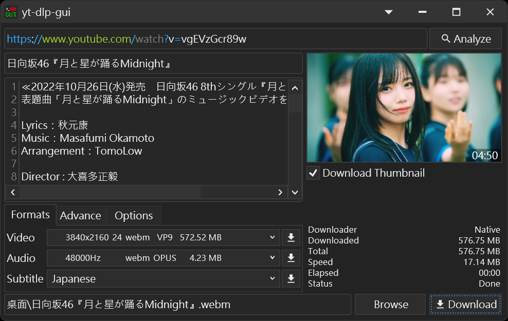

# yt-dlp-gui
(README Of [中文](README.zh.md))

* Front-end of [yt-dlp](https://github.com/yt-dlp/yt-dlp) and [youtube-dl](https://github.com/ytdl-org/youtube-dl)
* Windows Only

### Features
* Easy-to-use
* Portable

### Screenshots

### Requirements
* [yt-dlp](https://github.com/yt-dlp/yt-dlp) (Recommend) or [youtube-dl](https://github.com/ytdl-org/youtube-dl)
* [FFMPEG](https://ffmpeg.org/download.html#build-windows)

[yt-dlp](https://github.com/yt-dlp/yt-dlp) is a [youtube-dl](https://github.com/ytdl-org/youtube-dl) fork based,
Command-line program to download videos from YouTube.com and other video sites,
[yt-dlp](https://github.com/yt-dlp/yt-dlp) project is adding new features and patches while also keeping up to date with the original project.

### Optional
* [aria2](https://aria2.github.io/)

### How to Use (Suggested Steps)
1. Download [`yt-dlp-gui.exe`](https://github.com/kannagi0303/yt-dlp-gui/releases)
2. Create a Folder `bin` at the location of `yt-dlp-gui.exe`
3. Copy `yt-dlp.exe` and `ffmpeg.exe` into Folder `bin`
4. Execute `yt-dlp-gui.exe`

* The first execution will generate the `yt-dlp-gui.yaml` file, which is used to store the settings.

#### Use Configuration (refer to [configuration](https://github.com/yt-dlp/yt-dlp#configuration))
1. Create a Folder `configs` in location of executable file
2. Put configuration file(s) into Folder `configs` (text file)

* Need Restart for scan configuration file(s)

#### Use Aria2 (Suggested Steps)
1. If `yt-dlp-gui.exe` Is Running, Close it first.
2. Create a Folder `bin` at the location of `yt-dlp-gui.exe`
3. Copy `aria2c.exe` into Folder `bin`

* Need Restart for scan `aria2c.exe` file

### Important changes
Versions in `2022.10.03` and later, Attached files can now be placed in the same location as `yt-dlp-gui.exe`, or in **any named** subfolder under `yt-dlp-gui.exe` (even nested)
* yt-dlp.exe (also `yt-dlp_min.exe`, `yt-dlp_x86.exe`)
* youtube-dl.exe
* ffmpeg.exe
* aria2c.exe

So you can put the attached files in the `bin` folder. or Like this:
.\any1\yt-dlp.exe 
.\any2\ffmpeg.exe 
.\any3\any4\aria2c.exe 

Use `youtube-dl.exe`, Need remove `yt-dlp.exe` First.
For Now, No Options for it, Order is `yt-dlp.exe` First

### How to Remove
Just delete `yt-dlp-gui.exe`

### Authors
* かんなぎ (Kannagi)

Since I couldn't find a suitable GUI interface for my own use, 
I wrote it roughly myself for the convenience of using yt-dlp, 
using C# and WPF, The basic usage is no big problem,
If you have any questions, please let me know and I will deal with it as soon as possible,
Suggestions and questions are also welcome to reflect me, 
mainly in Chinese or simple English, while Japanese is also available
(Sorry for using machine translation)