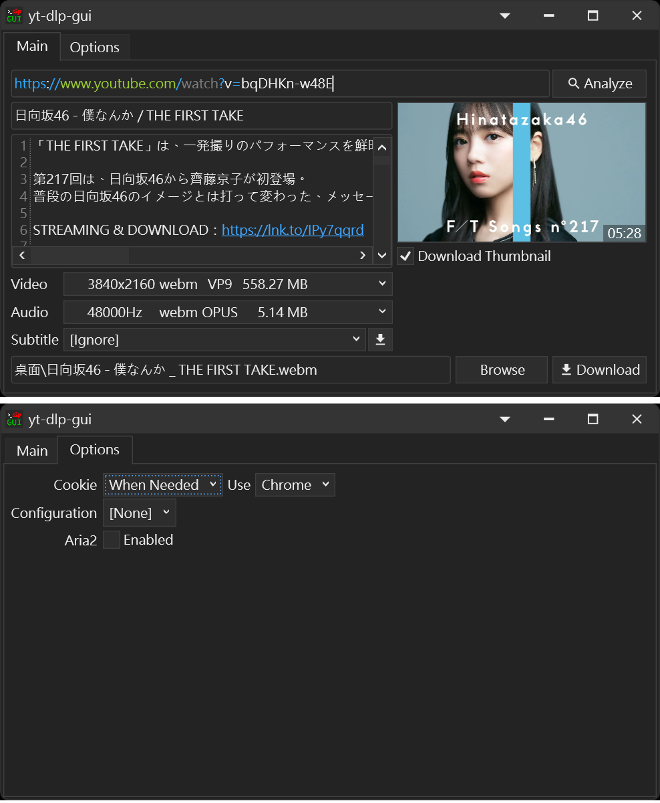

# yt-dlp-gui
(README Of [中文](README.zh.md))

* Front-end of [yt-dlp](https://github.com/yt-dlp/yt-dlp)
* Windows Only

[yt-dlp](https://github.com/yt-dlp/yt-dlp) is a [youtube-dl](https://github.com/ytdl-org/youtube-dl) fork based,
Command-line program to download videos from YouTube.com and other video sites,
[yt-dlp](https://github.com/yt-dlp/yt-dlp) project is adding new features and patches while also keeping up to date with the original project.

### Screenshots

### Requirements
* [yt-dlp](https://github.com/yt-dlp/yt-dlp)
* [FFMPEG](https://ffmpeg.org/download.html#build-windows)

### Optional
* [aria2](https://aria2.github.io/)

### How to Use
1. Download `yt-dlp-gui.exe`
2. Create a Folder `bin` in location of executable file
3. Copy `yt-dlp.exe` and `ffmpeg.exe` into Folder `bin`
4. Execute

#### Use Configuration (refer to [configuration](https://github.com/yt-dlp/yt-dlp#configuration))
1. Create a Folder `configs` in location of executable file
2. Put configuration file(s) into Folder `configs` (text file)

* Need Restart for scan configuration file(s)
* Currently only supports `-f`, `--format`, `-o`, `--output`
* The Configuration will be applied when `Analyze` the URL (Choose video quality and output template according to Configuration File)

#### Use Aria2
Copy `aria2c.exe` into Folder `bin`

### Authors
* かんなぎ (Kannagi)

Since I couldn't find a suitable GUI interface for my own use, 
I wrote it roughly myself for the convenience of using yt-dlp, 
using C# and WPF, The basic usage is no big problem
    
Because it is the first time to publish in github, there are many parts unfamiliar, 
in the future to organize and release the source code
Suggestions and questions are also welcome to reflect me, 
mainly in Chinese or simple English, while Japanese is also available
(Sorry for using machine translation)