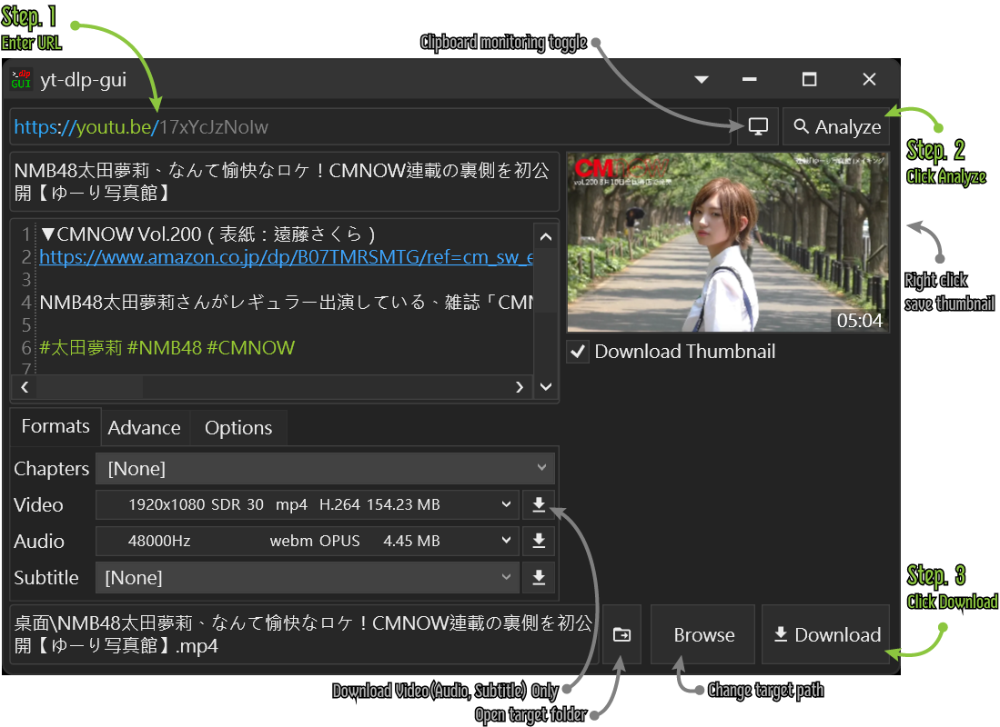

# yt-dlp-gui
(README [Englilsh](#english) | [中文](#中文))

* Front-end of [yt-dlp](https://github.com/yt-dlp/yt-dlp)
* Windows Only

[yt-dlp](https://github.com/yt-dlp/yt-dlp) is a [youtube-dl](https://github.com/ytdl-org/youtube-dl) fork based,
Command-line program to download videos from YouTube.com and other video sites,
[yt-dlp](https://github.com/yt-dlp/yt-dlp) project is adding new features and patches while also keeping up to date with the original project.

    Since I couldn't find a suitable GUI interface for my own use, 
    I wrote it roughly myself for the convenience of using yt-dlp, 
    using C# and WPF, The basic usage is no big problem
    
    Because it is the first time to publish in github, there are many parts unfamiliar, 
    in the future to organize and release the source code
    Suggestions and questions are also welcome to reflect me, 
    mainly in Chinese or simple English, while Japanese is also available
    (Sorry for using machine translation)

### Screenshots

### Requirements
* [yt-dlp](https://github.com/yt-dlp/yt-dlp)
* [FFMPEG](https://ffmpeg.org/download.html#build-windows)

### How to Use
1. Download & extract
2. Create a Folder `bin` in location of executable file
3. Copy `yt-dlp.exe` and `ffmpeg.exe` to Folder `bin`
4. Execute `yt-dlp-gui.exe`

### Authors
* Kannagi

## 中文
由於無法找到適合自己使用的GUI介面, 
為了方便使用 yt-dlp, 所以粗略的自己來寫, 
使用的是 C# 與 WPF, 基本的使用已無大問題

由於是第一次發佈在github, 有許多部份不熟悉, 日後在整理與放出源碼
有建議與問題也歡迎反映給我, 主要為中文或簡單的英文, 同時日文也是可以

* [yt-dlp](https://github.com/yt-dlp/yt-dlp) 的前端GUI
* 作業系統 Windows 限定

### 截圖

### 執行需求
* [yt-dlp](https://github.com/yt-dlp/yt-dlp)
* [FFMPEG](https://ffmpeg.org/download.html#build-windows)

### 如何使用
1. 下載以及解壓縮
2. 於執行檔位置建立`bin`資料夾
3. 將`yt-dlp.exe`以及`ffmpeg.exe`複製進`bin`資料夾中
4. 執行`yt-dlp-gui.exe`

### 作者
* Kannagi
